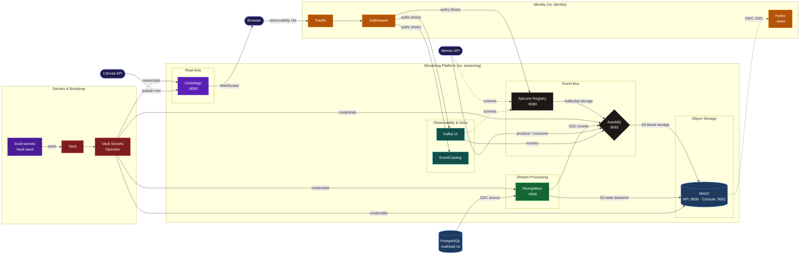

# MathTrail Streaming Infrastructure

Streaming and event-driven infrastructure for the MathTrail platform. Provides the event bus, schema registry, stream processing, real-time messaging, and supporting observability tooling.

## Architecture



## Prerequisites

- A running K3d cluster (managed by [infra-local-k3s](https://github.com/MathTrail/infra-local-k3s))

## Quick Start

Open this repo in the devcontainer, then:

```bash
just deploy
```

This will:

1. Add the `mathtrail` Helm repo
2. Create the `mathtrail` namespace
3. Install services with local development values

To remove everything:

```bash
just delete
```

## Services

| Service          | Deployed via                  | Namespace          | Access                                       |
|------------------|-------------------------------|--------------------|----------------------------------------------|
| PostgreSQL       | Helm (`postgresql`)           | `mathtrail`        | `postgres-postgresql.mathtrail.svc:5432`     |
| PgBouncer        | Raw manifests (kubectl)       | `mathtrail`        | `pgbouncer.mathtrail.svc:5432`               |
| Redis            | Helm (`redis`)                | `mathtrail`        | `redis-master.mathtrail.svc:6379`            |
| Vault            | Helm (`vault`)                | `vault`            | `vault.vault.svc:8200`                       |
| External Secrets | Helm (`external-secrets`)     | `external-secrets` | Cluster-wide operator                        |
| Telepresence     | Helm (`telepresence-oss`)     | `ambassador`       | Traffic Manager for local dev                |

## Default Credentials

| Service    | Username    | Password    | Database    |
|------------|-------------|-------------|-------------|
| PostgreSQL | `mathtrail` | `mathtrail` | `mathtrail` |
| Redis      | —           | `mathtrail` | —           |

## Configuration

### Helm values — [`values/`](values/)

- [`postgresql-values.yaml`](values/postgresql-values.yaml) — standalone, 1Gi storage, nano resources
- [`redis-values.yaml`](values/redis-values.yaml) — standalone, 1Gi storage, nano resources
- [`vault-values.yaml`](values/vault-values.yaml) — Vault server config
- [`external-secrets-values.yaml`](values/external-secrets-values.yaml) — External Secrets operator config
- [`telepresence-values.yaml`](values/telepresence-values.yaml) — Telepresence traffic manager config

### Raw manifests — [`manifests/`](manifests/)

- [`pgbouncer.yaml`](manifests/pgbouncer.yaml) — PgBouncer connection pooler
- [`pgbouncer-dashboard.yaml`](manifests/pgbouncer-dashboard.yaml) — PgBouncer dashboard
- [`vault-init-job.yaml`](manifests/vault-init-job.yaml) — Job that configures Vault (Database Secrets Engine, K8s auth)
- [`cluster-secret-store.yaml`](manifests/cluster-secret-store.yaml) — ClusterSecretStore for External Secrets

## Streaming Services

Streaming infrastructure deployed to the `streaming` namespace via ArgoCD.

| Service | K8s Service | Namespace | Port |
|---------|-------------|-----------|------|
| AutoMQ (Kafka-compatible) | `streaming-automq-kafka` | `streaming` | 9092 |
| Apicurio Schema Registry | `streaming-apicurio-apicurio-registry` | `streaming` | 8080 |
| Kafka UI | `streaming-kafka-ui` | `streaming` | 8080 |
| EventCatalog | `streaming-eventcatalog-eventcatalog-local` | `streaming` | 8080 |
| MinIO API | `streaming-minio` | `streaming` | 9000 |
| MinIO Console | `streaming-minio-console` | `streaming` | 9001 |
| RisingWave | `risingwave-frontend` | `streaming` | 4566 |
| Centrifugo | `streaming-centrifugo` | `streaming` | 8000 |

> [!WARNING]
> **RisingWave nightly override active.** `infra/local/helm/risingwave/values.yaml` pins
> `image.tag: nightly-20260410` to enable PostgreSQL 18 CDC support
> (fix merged 2026-02-11, [risingwavelabs/risingwave#24765](https://github.com/risingwavelabs/risingwave/pull/24765),
> not yet in a stable release).
> **Remove the `image.tag` override once RisingWave v2.9.0+ with PG18 CDC is released.**

## Accessing UIs

All web UIs are exposed through the identity gateway at `https://mathtrail.localhost`.
Authentication (cookie session) and authorization (`Monitoring:ui#viewer` Keto relation) are enforced by Oathkeeper.

| UI | URL | Notes |
|----|-----|-------|
| Kafka UI | https://mathtrail.localhost/observability/kafka-ui/ | AutoMQ cluster + Apicurio schema registry |
| Apicurio Registry | https://mathtrail.localhost/observability/apicurio/ | Schema management (Avro, Protobuf, JSON Schema) |
| EventCatalog | https://mathtrail.localhost/observability/eventcatalog/ | EDA event/service documentation |
| MinIO Console | https://minio.mathtrail.localhost/ (redirects from /observability/minio) | S3 bucket management (automq-data, risingwave-data) |

> To grant access, add a Keto relation tuple: `Monitoring:ui#viewer@<user-id>`

### Default credentials (local dev only)

| Service | Username | Password | Secret |
|---------|----------|----------|--------|
| MinIO Console | `minioadmin` | `minioadmin` | `streaming/minio-root-creds` (Vault KV) |
